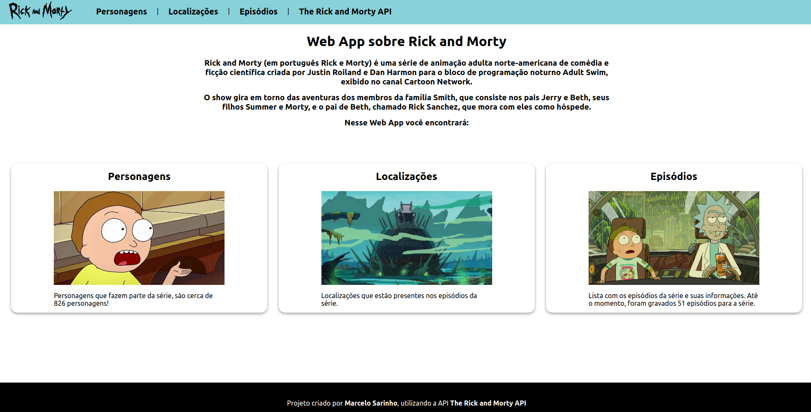
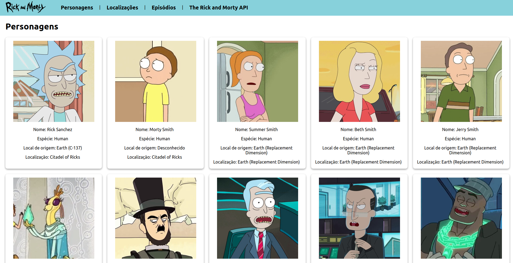
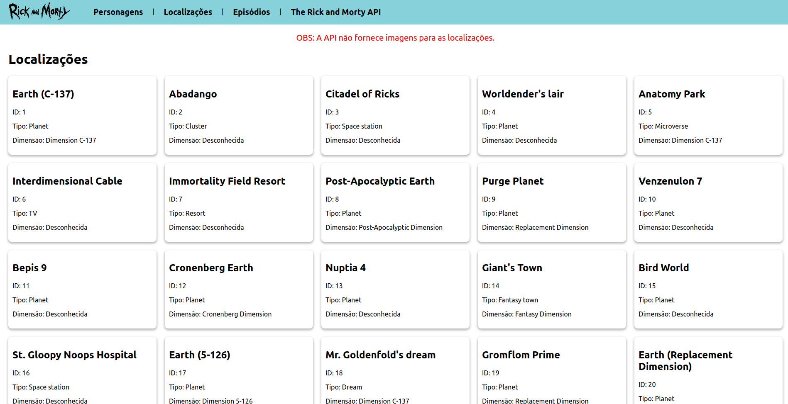
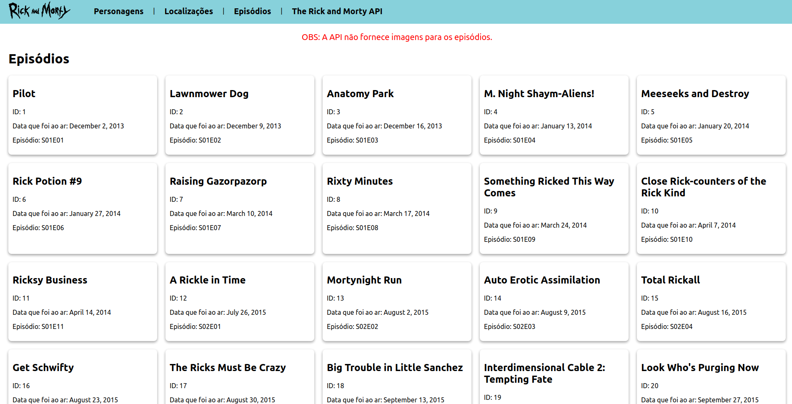

<h1 align="center">Rick and Morty App</h1>
<p align="center">Esse site apresenta informações sobre a série de animação adulta Rick and Morty.</p>
</br>
<p align="center">
<a href="https://github.com/marcelosarinho/rickAndMortyApp/issues"></a>
<a href="https://github.com/marcelosarinho/rickAndMortyApp/network"></a>
<a href="https://github.com/marcelosarinho/rickAndMortyApp/stargazers"></a>
</p>
<p align="center">
<a href="#sobre">Sobre</a> • 
<a href="#pre-requisitos">Pré-Requisitos</a> • 
<a href="#tecnologias">Tecnologias</a> • 
<a href="#licenca">Licença</a> •
<a href="#autor">Autor</a>
</p>
<h4 align="center"> ✔️ Projeto finalizado! ✔️ </h4>
<h1></h1>
<h2>🌐 Demonstração</h2>
<div>
  <h3 align="center">
   
  </h3>
  <br/>
  <h3 align="center">
   
  </h3>
  <br/>
  <h3 align="center">
   
  </h3>
  <br/>
  <h3 align="center">
   
  </h3>
</div>
<h2 id="sobre">📖 Sobre</h2>
<p>Esse repositório é um site fornece informações sobre a série Rick and Morty, como os personagens, localizações e episódios da série. O projeto foi criado com intuito de praticar HTML, CSS, JavaScript, React e React Router. Foi utilizada a <a href="https://rickandmortyapi.com/">The Rick and Morty API</a>.</p>
<h2 id="pre-requisitos">📋 Pré-Requisitos</h2>
<p>Para testar essa aplicação, é necessário <a href="https://git-scm.com/">Git</a> e <a href="https://www.npmjs.com/">npm</a> (ou <a href="https://yarnpkg.com/">Yarn</a>).</p>
<p>Caso queira testar o projeto na sua máquina, siga esses passos:</p>

```bash
# Clone o repositório
$ git clone <https://github.com/marcelosarinho/rickAndMortyApp>

# Acesse a pasta do projeto clonado
$ cd rickAndMortyApp

# Instale as dependências necessárias para o projeto
$ npm install

# Execute o comando
$ npm start

# O site aparecerá automaticamente, caso não apareça acesse <http://localhost:3000/>

```

<h2 id="tecnologias">💻 Tecnologias utilizadas</h2>


<br/>

<br/>
<a href="https://www.javascript.com/"></a>
<br/>
<a href="https://reactjs.org/"></a>
<br/>
<a href="https://reactrouter.com/"></a>
<h2 id="licenca">📜 Licença</h2>
Esse projeto utiliza a Licença MIT.
<h2 id="autor">👨‍💻 Autor</h2>
<br/>
<div align="center">
<a href="https://github.com/marcelosarinho">

</a>
<h3>Marcelo Sarinho</h3>
<h4>Contato</h4>
<a href="https://github.com/marcelosarinho"></a>
<a href="https://www.linkedin.com/in/marcelo-sarinho-a4706923a/"></a>
<a href="mailto:marceloactsarinho@gmail.com"></a>
</div>
